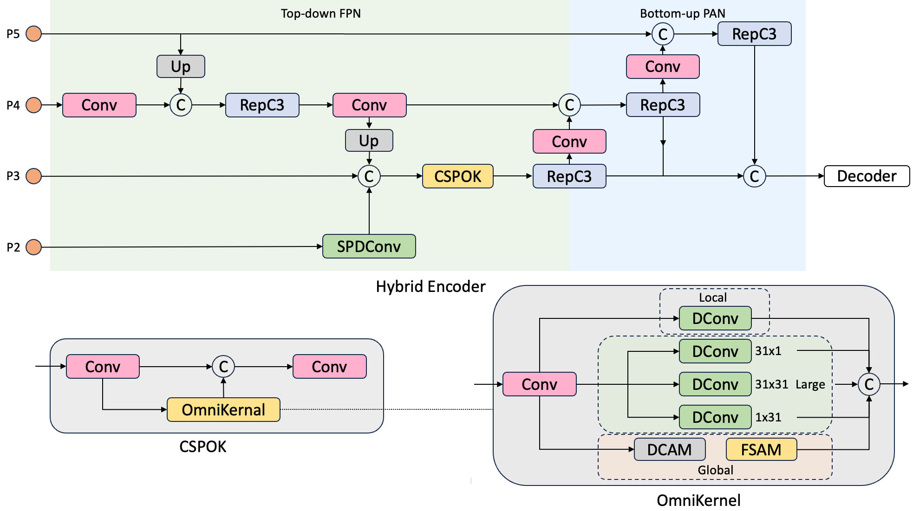

# RT-DETR-SEA: Small Object Enhanced Architecture for Beach Debris Detection

RT-DETR-SEA is an enhanced architecture for small object detection in complex natural environments, specifically designed for detecting marine debris on beaches using drone imagery.

## Abstract

Object detection in complex natural environments such as beaches poses significant challenges due to the prevalence of small marine debris when capturing with drones. The main difficulties are homogeneous and low-contrast backgrounds, color similarities between targets and surroundings, and small objects which are often occluded. 

To address these challenges, this project proposes a **S**mall Object **E**nhanced **A**rchitecture (SEA) to the RT-DETR hybrid encoder to improve small object detection performance in beach environments. The enhanced encoder integrates an SPDConv layer into the P2 feature layer to capture spatial information and introduce a CSPOmniKernel module after feature concatenation to build up multi-scale feature representation.

## Replication

To replicate the results:

1. Adjust the relative paths in the `data.yaml` file to match your dataset location.
2. Adjust the config files in `ultralytics/cfg/models/rt-detr/` to `train.py`.
3. Run the `train.py` script:
```bash
python train.py
```

## Visualization Tools

Several scripts are provided for visualizing results:

- `plot_result.py`: Plots loss and metric curves side by side.
- `heatmap.py`: Generates heatmaps for model interpretability.
- `get_FPS.py`: Measures the frames per second (FPS) performance of the model.

## Architecture Comparison

To compare the architectural differences between the baseline model and RT-DETR-SEA, refer to the configuration files in the `ultralytics/cfg/models/rt-detr` directory.

## Dependencies and Setup

Before running the code, please follow these steps:

1. Uninstall any existing `ultralytics` library from your environment:
   ```bash
   pip uninstall ultralytics
   ```
   Repeat this step until you see the message: "WARNING: Skipping ultralytics as it is not installed."

2. (Optional) If you need to use the official CLI running method, install the `ultralytics` library:
   ```bash
   python setup.py develop
   ```
   Note: This step can be skipped if you don't need the official CLI.

3. Install additional required packages:
   ```bash
   pip install timm==0.9.8 thop efficientnet_pytorch==0.7.1 einops grad-cam==1.4.8 dill==0.3.6 albumentations==1.3.1 pytorch_wavelets==1.3.0 tidecv PyWavelets -i https://pypi.tuna.tsinghua.edu.cn/simple
   ```

Note: It's recommended to use Anaconda to create a virtual environment for this project to avoid conflicts with other environments, especially if you're also using YOLOv8.

For more information on the `develop` installation method, refer to [this explanation](https://blog.csdn.net/qq_16568205/article/details/110433714).

## Key Features



- **SPDConv Layer**: Integrated into the P2 feature layer to capture spatial information.
- **CSPOmniKernel Module**: Introduced after feature concatenation for multi-scale feature representation.
- **Improved Performance**: 13.51% increase in mAP@50 compared to the baseline RT-DETR-r18 model.
- **Efficiency**: 46.86% higher frames per second (FPS) rate than simply adding a P2 layer.

## Results

Through ablation study and comparison with different models on three distinct datasets focused on marine debris, our RT-DETR-SEA showed:

- 13.51% increase in mAP@50 compared to the baseline RT-DETR-r18 model
- 9.34% increase in mAP@50 against directly adding a P2 layer
- 46.86% higher frames per second (FPS) rate than simply adding a P2 layer